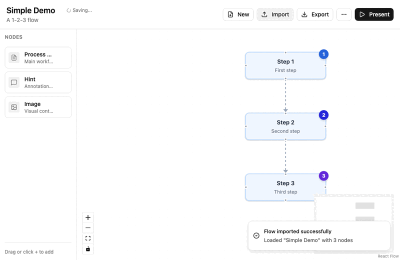

# BoxFlow

A visual flow editor for creating step-by-step presentations. Built with React Flow.



## Features

- **Visual Editor** - Drag and drop nodes to create flow diagrams
- **Multiple Node Types** - Process steps, hints, and images
- **Presentation Mode** - Step through your flow with keyboard navigation
- **Import/Export** - Save and load flows as JSON

## Getting Started

```bash
bun install
bun dev
```

## Example Flow

Import this JSON to create a simple flow:

```json
{
  "meta": { "title": "Simple Demo", "subtitle": "A 1-2-3 flow" },
  "nodes": [
    { "id": "1", "type": "processStep", "position": { "x": 400, "y": 80 }, "revealAtStep": 1, "data": { "title": "Step 1", "description": "First step" } },
    { "id": "2", "type": "processStep", "position": { "x": 400, "y": 230 }, "revealAtStep": 2, "data": { "title": "Step 2", "description": "Second step" } },
    { "id": "3", "type": "processStep", "position": { "x": 400, "y": 380 }, "revealAtStep": 3, "data": { "title": "Step 3", "description": "Third step" } }
  ],
  "edges": [
    { "id": "e1-2", "source": "1", "target": "2" },
    { "id": "e2-3", "source": "2", "target": "3" }
  ]
}
```

## Tech Stack

- React 19
- React Flow
- TypeScript
- Tailwind CSS
- Vite
