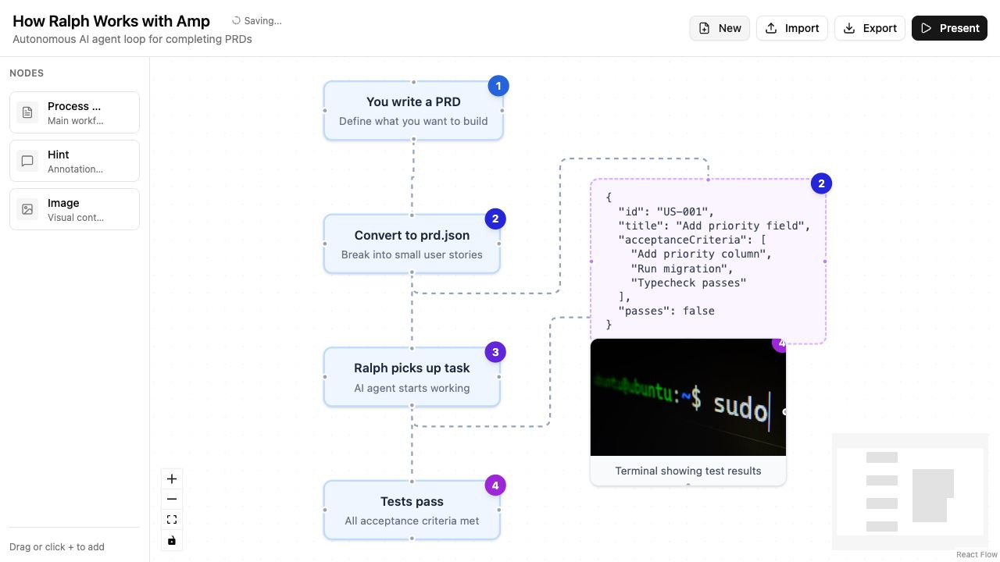

# BoxFlow

A visual flow editor for creating step-by-step presentations. Built with React Flow.



## Features

- **Visual Editor** - Drag and drop nodes to create flow diagrams
- **Multiple Node Types** - Process steps, hints, and images
- **Presentation Mode** - Step through your flow with keyboard navigation
- **Import/Export** - Save and load flows as JSON

## Getting Started

```bash
bun install
bun dev
```

## Tech Stack

- React 19
- React Flow
- TypeScript
- Tailwind CSS
- Vite
